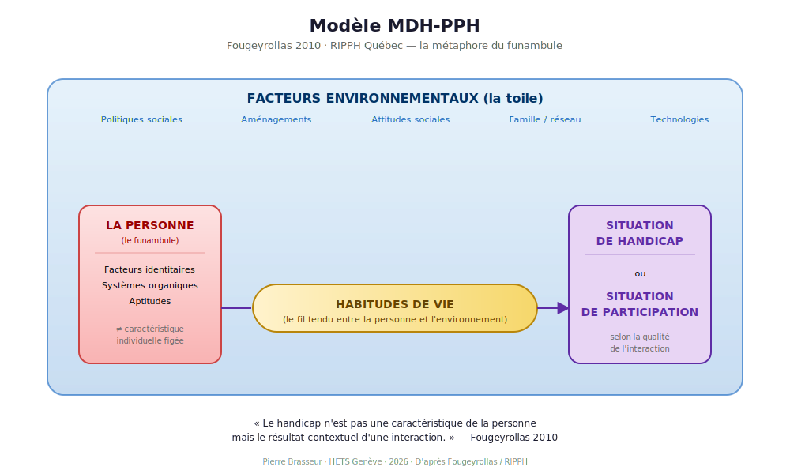

# Modèle MDH-PPH (Fougeyrollas)

::: {.callout-note appearance="simple"}
## Thèse
Le handicap résulte d'une **interaction** entre facteurs personnels, facteurs environnementaux et habitudes de vie. Il n'est ni dans la personne ni dans l'environnement, mais dans leur rencontre.
:::

## Origine et diffusion

Le **Modèle de développement humain – Processus de production du handicap (MDH-PPH)** est développé par Patrick Fougeyrollas et le RIPPH (Réseau international du processus de production du handicap) au Québec [@fougeyrollas2010]. C'est le modèle francophone de référence dans le champ.

> *« Le handicap n'est pas une caractéristique de la personne mais le résultat contextuel d'une interaction. »*
>
> --- @fougeyrollas2010

{#fig-mdhpph}

## La métaphore du funambule

La personne (funambule) avance sur un fil (habitudes de vie) tendu dans une toile (environnement). Une **situation de handicap** survient quand la qualité de la toile ne soutient pas le passage. **Inversement**, une situation de participation sociale survient quand la toile soutient.

| Élément | Catégorie | Exemples |
|---|---|---|
| Le funambule | Facteurs personnels | Systèmes organiques, aptitudes, facteurs identitaires |
| Le fil | Habitudes de vie | Activités courantes, rôles sociaux valorisés |
| La toile | Facteurs environnementaux | Politiques sociales, aménagements, attitudes, technologies, famille |

## Posture professionnelle qu'il appelle

Le TS comme **évaluateur situationnel**. Il cartographie les facilitateurs et les obstacles dans l'environnement de la personne, identifie les habitudes de vie compromises, négocie des aménagements.

## Diffusion en Suisse romande

C'est ce modèle qui structure la recherche romande sur l'accessibilité et la participation sociale, notamment à la HETS Genève [@masse2018]. L'outil **MHAVIE** (Mesure des habitudes de vie) en dérive directement. Cette approche a permis d'analyser 47 institutions romandes auprès d'environ 7 000 adultes avec déficience intellectuelle.

## Limite opérationnelle

::: {.callout-warning appearance="simple"}
## Difficulté de mise en œuvre
Le MDH-PPH est complexe — c'est sa force conceptuelle. Mais cette complexité le rend parfois difficile à opérationnaliser dans des dispositifs administratifs qui exigent des catégorisations fixes (l'AI ne sait pas évaluer une « situation de handicap variable »).

Le TS qui mobilise le MDH-PPH doit savoir **traduire** : produire des évaluations standardisées pour les financeurs *et* maintenir une lecture dynamique en équipe.
:::
